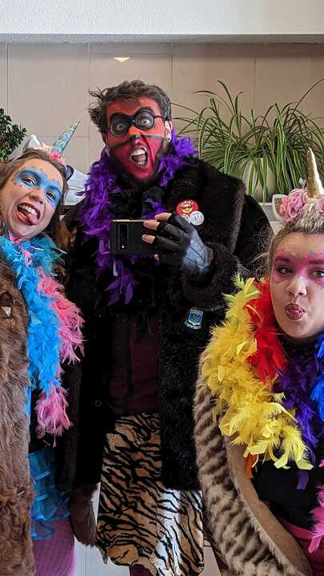

# Chargé de gamification et analyses UX

---
## Ça c'est moi : 

---
## Ça c'est aussi moi : 

---

# Gamifi-quoi ??

---

# La gamification :

> **Gamification**: Faire d'un truc chiant, un truc amusant 
> 	*Le p'tit S. 2023*

---

## Mon rôle :

Créer de l'engagement chez les utilisateurs de Moha ☀️ à travers diverses mécaniques de jeux

---

# Data Analyst

> Chaque donnée raconte une histoire 
> 	*S. 2023*

--- 

## Mon rôle de data :

- Générer de chouettes rapports 
- Valoriser les données de recherche
- Vulgariser 

--- 

# Automatisation / Data engineer

> Si tu le fait plus d'une fois, automatise le. 
> 	*S. 2023*
